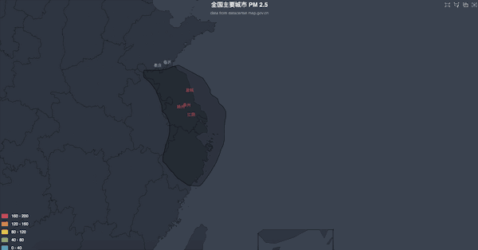

# PM 2.5 数据可视化
## 效果展示：

## 实现原理：
1. 用node.js爬虫获取pm2.5 数据
2. 用echarts.js进行数据可视化展示

## 本地实现：
1. 下载项目前，确认本机已安装最新版本的Node.js，
2. 下载项目后，在解压后的项目根目录执行 npm install 完成库的安装
3. 点击index.html即可得到数据可视化展示

## 模块需求：
+ cheerio
+ request
+ echarts [The link](https://github.com/ecomfe/echarts)
